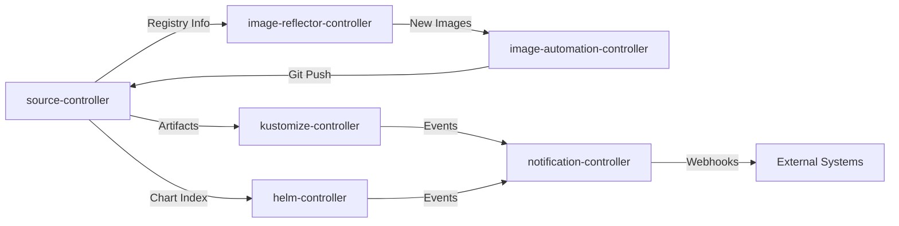

Kimbernetes runs **FluxCD v2.7.5**, a complete GitOps toolkit that consists of six specialized controllers working together to maintain the desired state of your Kubernetes cluster.

## Flux System Overview

All Flux components run in the `flux-system` namespace and are installed via the `gotk-components.yaml` manifest generated during bootstrap.

```bash
kubectl get pods -n flux-system
```

Expected output:
```
NAME                                       READY   STATUS    RESTARTS   AGE
source-controller-xxxxx                    1/1     Running   0          30d
kustomize-controller-xxxxx                 1/1     Running   0          30d
helm-controller-xxxxx                      1/1     Running   0          30d
notification-controller-xxxxx              1/1     Running   0          30d
image-reflector-controller-xxxxx           1/1     Running   0          30d
image-automation-controller-xxxxx          1/1     Running   0          30d
```

## Core Controllers

### source-controller

The source-controller is responsible for acquiring artifacts from external sources and making them available to other Flux components.

<Tabs>
  <Tab title="Purpose">
    **Primary Role**: Fetch and cache artifacts from various sources
    
    - Monitors Git repositories for changes
    - Manages Helm chart repositories
    - Handles S3/OCI buckets
    - Creates and maintains artifact archives
    - Provides HTTP endpoints for artifact access
    
    <Note>
      The source-controller is the foundation of Flux - without it, no other controller can access your configurations.
    </Note>
  </Tab>
  
  <Tab title="Custom Resources">
    The source-controller manages these CRDs:
    
    **GitRepository** - Git repository sources
    ```yaml
    apiVersion: source.toolkit.fluxcd.io/v1
    kind: GitRepository
    metadata:
      name: flux-system
      namespace: flux-system
    spec:
      interval: 1m0s
      ref:
        branch: main
      secretRef:
        name: flux-system
      url: ssh://git@github.com/kim-ae/kimbernetes-k8s-flux
    ```
    
    **HelmRepository** - Helm chart repositories
    
    **Bucket** - S3-compatible buckets
    
    **ExternalArtifact** - External artifact references
  </Tab>
  
  <Tab title="Configuration">
    Key configuration in `cluster/kimawesome/flux-system/gotk-sync.yaml`:
    
    - **Interval**: `1m0s` - Check for changes every minute
    - **Branch**: `main` - The Git branch to monitor
    - **Authentication**: SSH key stored in `flux-system` secret
    
    The source-controller exposes metrics on port `8080` and runs with specific RBAC permissions to access cluster resources.
  </Tab>
</Tabs>

### kustomize-controller

The kustomize-controller applies Kustomize configurations to the cluster, processing overlays and patches to produce final manifests.

<CardGroup cols={2}>
  <Card title="Reconciliation" icon="arrows-rotate">
    Continuously reconciles Kustomization resources, ensuring cluster state matches Git
  </Card>
  <Card title="Build Process" icon="hammer">
    Processes Kustomize overlays, applying patches and generating final manifests
  </Card>
  <Card title="Health Checks" icon="heart-pulse">
    Monitors deployed resources for health and readiness
  </Card>
  <Card title="Pruning" icon="scissors">
    Removes resources that are no longer defined in Git when `prune: true`
  </Card>
</CardGroup>

<Accordion title="Kustomization Resource Example">
  The primary Kustomization that Flux reconciles:
  
  ```yaml
  apiVersion: kustomize.toolkit.fluxcd.io/v1
  kind: Kustomization
  metadata:
    name: flux-system
    namespace: flux-system
  spec:
    interval: 10m0s
    path: ./cluster/kimawesome
    prune: true
    sourceRef:
      kind: GitRepository
      name: flux-system
  ```
  
  Key fields:
  - **interval**: How often to reconcile (10 minutes)
  - **path**: Directory in Git to process
  - **prune**: Delete resources not in Git
  - **sourceRef**: Which GitRepository to use
</Accordion>

<Accordion title="Dependency Management">
  Kustomizations can depend on other Kustomizations:
  
  ```yaml
  apiVersion: kustomize.toolkit.fluxcd.io/v1beta2
  kind: Kustomization
  metadata:
    name: infrastructure
    namespace: flux-system
  spec:
    interval: 10m
    path: "./overlays/kimawesome/infrastructure"
    prune: true
    sourceRef:
      kind: GitRepository
      name: flux-system
    dependsOn:
      - name: metallb
        namespace: kube-system
  ```
  
  This ensures infrastructure is deployed **after** metallb is ready.
</Accordion>

<Accordion title="Permissions">
  The kustomize-controller runs with **ClusterAdmin** privileges via the `cluster-reconciler-flux-system` ClusterRoleBinding:
  
  ```yaml
  subjects:
  - kind: ServiceAccount
    name: kustomize-controller
    namespace: flux-system
  roleRef:
    apiGroup: rbac.authorization.k8s.io
    kind: ClusterRole
    name: cluster-admin
  ```
  
  <Note>
    This broad permission is required to manage any resource type in the cluster. Consider using more restrictive RBAC for production environments if needed.
  </Note>
</Accordion>

### helm-controller

The helm-controller automates Helm chart deployments, managing the full lifecycle of Helm releases.

<Steps>
  <Step title="Watch HelmRelease Resources">
    Monitors HelmRelease custom resources for changes
  </Step>
  
  <Step title="Fetch Chart">
    Retrieves the Helm chart from the specified HelmRepository
  </Step>
  
  <Step title="Render Templates">
    Processes Helm templates with provided values
  </Step>
  
  <Step title="Install or Upgrade">
    Installs new releases or upgrades existing ones
  </Step>
  
  <Step title="Monitor Health">
    Watches deployed resources for health status
  </Step>
  
  <Step title="Rollback on Failure">
    Automatically rolls back failed upgrades if configured
  </Step>
</Steps>

<Tabs>
  <Tab title="HelmRepository">
    Defines where to fetch Helm charts:
    
    ```yaml
    apiVersion: source.toolkit.fluxcd.io/v1
    kind: HelmRepository
    metadata:
      name: metallb
      namespace: kube-system
    spec:
      interval: 24h
      url: https://metallb.github.io/metallb
    ```
    
    The source-controller fetches the chart index every 24 hours.
  </Tab>
  
  <Tab title="HelmRelease">
    Defines how to deploy a Helm chart:
    
    ```yaml
    apiVersion: helm.toolkit.fluxcd.io/v2
    kind: HelmRelease
    metadata:
      name: metallb
      namespace: kube-system
    spec:
      chart:
        spec:
          chart: metallb
          sourceRef:
            kind: HelmRepository
            name: metallb
          version: "=0.15.3"
      interval: 24h
      releaseName: metallb
      install:
        crds: Create
      upgrade:
        crds: CreateReplace
      values:
        # Custom values here
    ```
    
    Key features:
    - **Version pinning**: `=0.15.3` ensures specific version
    - **CRD management**: Automatic CRD installation and updates
    - **Custom values**: Override chart defaults
    - **Reconciliation**: Check every 24 hours
  </Tab>
  
  <Tab title="Benefits">
    Using Flux for Helm provides several advantages:
    
    <CardGroup cols={2}>
      <Card title="Declarative" icon="file-code">
        Helm releases defined as Git-tracked resources
      </Card>
      <Card title="Automated" icon="robot">
        No manual helm upgrade commands needed
      </Card>
      <Card title="Auditable" icon="clock-rotate-left">
        All changes tracked in Git history
      </Card>
      <Card title="Consistent" icon="check-double">
        Same GitOps workflow as other resources
      </Card>
    </CardGroup>
  </Tab>
</Tabs>

### notification-controller

The notification-controller handles events and alerts, enabling integration with external systems.

<Accordion title="Event Handling">
  The controller processes events from other Flux components and can:
  
  - Send notifications to Slack, Discord, Microsoft Teams
  - Trigger webhooks for CI/CD integration
  - Update commit statuses on Git providers
  - Forward events to external monitoring systems
  
  While Kimbernetes doesn't currently use notifications extensively, the controller is available for future integration.
</Accordion>

<Accordion title="Provider Configuration">
  Example notification provider:
  
  ```yaml
  apiVersion: notification.toolkit.fluxcd.io/v1beta3
  kind: Provider
  metadata:
    name: slack
    namespace: flux-system
  spec:
    type: slack
    channel: flux-alerts
    secretRef:
      name: slack-webhook
  ```
  
  And corresponding alert:
  
  ```yaml
  apiVersion: notification.toolkit.fluxcd.io/v1beta3
  kind: Alert
  metadata:
    name: on-error
    namespace: flux-system
  spec:
    providerRef:
      name: slack
    eventSeverity: error
    eventSources:
      - kind: Kustomization
        name: '*'
  ```
</Accordion>

<Accordion title="Webhook Receivers">
  The notification-controller can receive webhooks from Git providers to trigger immediate reconciliation:
  
  ```yaml
  apiVersion: notification.toolkit.fluxcd.io/v1
  kind: Receiver
  metadata:
    name: flux-system
    namespace: flux-system
  spec:
    type: github
    events:
      - "ping"
      - "push"
    secretRef:
      name: webhook-token
    resources:
      - apiVersion: source.toolkit.fluxcd.io/v1
        kind: GitRepository
        name: flux-system
  ```
  
  This enables instant deployments instead of waiting for the polling interval.
</Accordion>

### image-reflector-controller

The image-reflector-controller scans container registries for new image versions.

<Note>
  This controller enables **automated image updates** - when a new container image is published, Flux can automatically update your manifests and deploy the new version.
</Note>

**Custom Resources:**

- **ImageRepository** - Defines which container registry to scan
- **ImagePolicy** - Defines rules for selecting image versions (e.g., semver ranges)

Example configuration:

```yaml
apiVersion: image.toolkit.fluxcd.io/v1beta2
kind: ImageRepository
metadata:
  name: myapp
  namespace: flux-system
spec:
  image: ghcr.io/myorg/myapp
  interval: 5m
---
apiVersion: image.toolkit.fluxcd.io/v1beta2
kind: ImagePolicy
metadata:
  name: myapp
  namespace: flux-system
spec:
  imageRepositoryRef:
    name: myapp
  policy:
    semver:
      range: '>=1.0.0 <2.0.0'
```

### image-automation-controller

The image-automation-controller automatically updates Git repositories when new images are detected.

**Workflow:**

1. image-reflector-controller detects new image version
2. image-automation-controller updates manifest in Git
3. Commits and pushes the change
4. source-controller detects the Git change
5. kustomize-controller/helm-controller deploys the new version

**Custom Resource:**

```yaml
apiVersion: image.toolkit.fluxcd.io/v1beta2
kind: ImageUpdateAutomation
metadata:
  name: flux-system
  namespace: flux-system
spec:
  interval: 5m
  sourceRef:
    kind: GitRepository
    name: flux-system
  git:
    checkout:
      ref:
        branch: main
    commit:
      author:
        email: fluxcdbot@users.noreply.github.com
        name: fluxcdbot
      messageTemplate: |
        Automated image update
        
        Updates:
        {{ range .Updated.Images -}}
        - {{.}} 
        {{ end -}}
    push:
      branch: main
  update:
    path: ./overlays/kimawesome
    strategy: Setters
```

<Tip>
  Image automation is powerful but optional. Kimbernetes currently uses manual image version management in HelmRelease resources for more control over updates.
</Tip>

## Controller Communication



## Monitoring Flux Components

<Tabs>
  <Tab title="Check Status">
    View the status of all Flux resources:
    
    ```bash
    flux get all --all-namespaces
    ```
    
    Check specific Kustomizations:
    
    ```bash
    flux get kustomizations -n flux-system
    ```
  </Tab>
  
  <Tab title="View Logs">
    View logs from Flux controllers:
    
    ```bash
    # Source controller logs
    kubectl logs -n flux-system -l app=source-controller
    
    # Kustomize controller logs
    kubectl logs -n flux-system -l app=kustomize-controller
    
    # Helm controller logs
    kubectl logs -n flux-system -l app=helm-controller
    ```
  </Tab>
  
  <Tab title="Reconcile Manually">
    Trigger immediate reconciliation:
    
    ```bash
    # Reconcile a specific Kustomization
    flux reconcile kustomization flux-system --with-source
    
    # Reconcile a HelmRelease
    flux reconcile helmrelease metallb -n kube-system
    ```
  </Tab>
  
  <Tab title="Metrics">
    Flux controllers expose Prometheus metrics on port 8080:
    
    ```bash
    kubectl port-forward -n flux-system svc/source-controller 8080:80
    curl http://localhost:8080/metrics
    ```
    
    Key metrics:
    - `gotk_reconcile_duration_seconds` - Reconciliation time
    - `gotk_reconcile_condition` - Resource conditions
    - `gotk_suspend_status` - Suspended resources
  </Tab>
</Tabs>

## Security Considerations

<CardGroup cols={2}>
  <Card title="RBAC" icon="shield-halved">
    Controllers use ServiceAccounts with specific RBAC permissions. The kustomize and helm controllers have ClusterAdmin access.
  </Card>
  <Card title="Network Policies" icon="network-wired">
    NetworkPolicies restrict traffic to and from Flux components, allowing only necessary communication.
  </Card>
  <Card title="Secret Management" icon="key">
    Git credentials and other secrets are stored in Kubernetes Secrets with appropriate access controls.
  </Card>
  <Card title="Pod Security" icon="lock">
    Flux namespace has pod security warnings enabled for restricted policies.
  </Card>
</CardGroup>

## Flux Version

<Note>
  Kimbernetes runs **Flux v2.7.5** with all six controllers enabled:
  
  ```
  source-controller
  kustomize-controller
  helm-controller
  notification-controller
  image-reflector-controller
  image-automation-controller
  ```
  
  This version was installed during bootstrap and is defined in `cluster/kimawesome/flux-system/gotk-components.yaml`:1-4.
</Note>

## Next Steps

<CardGroup cols={2}>
  <Card title="Kustomize Overlays" icon="layer-group" href="/architecture/kustomize-overlays">
    Learn how Kustomize overlays work with the kustomize-controller
  </Card>
  <Card title="Troubleshooting" icon="wrench" href="/operations/troubleshooting">
    Debug common Flux issues and understand controller behavior
  </Card>
  <Card title="Upgrading Flux" icon="arrow-up" href="/operations/upgrades">
    Learn how to safely upgrade Flux components
  </Card>
  <Card title="Repository Structure" icon="folder-tree" href="/architecture/repository-structure">
    Review how the repository is organized for Flux
  </Card>
</CardGroup>
