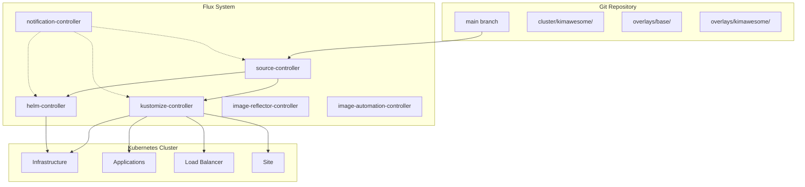
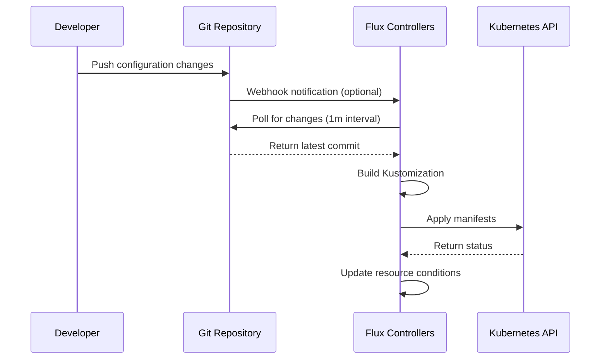

Kimbernetes implements a **GitOps architecture** using **FluxCD v2.7.5**, where the Git repository serves as the single source of truth for the entire Kubernetes cluster configuration. This approach enables declarative, auditable, and automated cluster management.

## GitOps Principles

<CardGroup cols={2}>
  <Card title="Git as Source of Truth" icon="code-branch">
    All cluster configuration is stored in Git, providing version control, audit trails, and rollback capabilities
  </Card>
  <Card title="Automated Synchronization" icon="arrows-rotate">
    Flux continuously monitors the Git repository and automatically applies changes to the cluster
  </Card>
  <Card title="Declarative Infrastructure" icon="file-code">
    Desired state is declared in manifests, and Flux ensures the cluster matches this state
  </Card>
  <Card title="Self-Healing System" icon="heart-pulse">
    Flux detects configuration drift and automatically reconciles to the desired state
  </Card>
</CardGroup>

## Architecture Diagram

## The Flux Reconciliation Loop

Flux operates through a continuous reconciliation loop that ensures your cluster state matches the Git repository:

<Steps>
  <Step title="Watch Git Repository">
    The **source-controller** monitors the Git repository at regular intervals (default: 1 minute) for changes
  </Step>
  
  <Step title="Fetch Changes">
    When changes are detected, Flux fetches the latest commit and creates an artifact containing the repository contents
  </Step>
  
  <Step title="Build Resources">
    The **kustomize-controller** processes Kustomization resources, building the final manifests by applying overlays and patches
  </Step>
  
  <Step title="Apply to Cluster">
    The controllers apply the manifests to the Kubernetes cluster, creating, updating, or deleting resources as needed
  </Step>
  
  <Step title="Monitor Status">
    Flux continuously monitors the health of deployed resources and reports status through conditions and events
  </Step>
  
  <Step title="Self-Heal">
    If configuration drift is detected (manual changes to the cluster), Flux automatically reverts to the Git-defined state
  </Step>
</Steps>

## Key Architectural Components

### Git Repository as Source

The repository structure separates concerns into distinct layers:

- **cluster/** - Flux bootstrap and cluster-level configuration
- **overlays/base/** - Reusable base configurations for applications and infrastructure
- **overlays/kimawesome/** - Environment-specific configurations and customizations

### Flux Controllers

FluxCD v2.7.5 runs six specialized controllers in the `flux-system` namespace:

<Accordion title="source-controller">
  Manages source artifacts from Git repositories, Helm repositories, and S3 buckets. It watches the Git repository and makes artifacts available to other controllers.
</Accordion>

<Accordion title="kustomize-controller">
  Processes Kustomization resources, applying Kustomize overlays and deploying manifests to the cluster. This is the primary controller for GitOps deployments.
</Accordion>

<Accordion title="helm-controller">
  Manages Helm releases, automatically deploying and upgrading Helm charts based on HelmRelease resources.
</Accordion>

<Accordion title="notification-controller">
  Handles events and notifications, enabling integration with external systems like Slack, Discord, or webhooks.
</Accordion>

<Accordion title="image-reflector-controller">
  Scans container registries for new image versions, enabling automated image updates.
</Accordion>

<Accordion title="image-automation-controller">
  Automatically updates Git repository with new image versions when detected by the image-reflector-controller.
</Accordion>

## Deployment Flow

The typical deployment flow in Kimbernetes follows this pattern:

<Note>
  The GitRepository resource is configured to check for changes every **1 minute**, while Kustomizations reconcile every **10 minutes**. This balance ensures timely updates without excessive API calls.
</Note>

## Environment Organization

Kimbernetes uses a multi-layered overlay structure to organize configurations:

1. **Base Layer** - Generic, reusable configurations in `overlays/base/`
2. **Environment Layer** - Environment-specific configurations in `overlays/kimawesome/`
3. **Category Organization** - Further organized by function:
   - **loadbalancer/** - MetalLB configuration for bare-metal load balancing
   - **infrastructure/** - Core infrastructure services (cert-manager, observability, sealed-secrets)
   - **applications/** - Application workloads (DNS, tooling, version management)
   - **site/** - Website and knowledge hub deployments

## Security and Access Control

<CardGroup cols={2}>
  <Card title="RBAC Integration" icon="shield-halved">
    Flux controllers use Kubernetes ServiceAccounts with ClusterAdmin privileges for reconciliation
  </Card>
  <Card title="SSH Authentication" icon="key">
    Git repository access uses SSH keys stored in Kubernetes Secrets
  </Card>
  <Card title="Network Policies" icon="network-wired">
    NetworkPolicies restrict traffic to and from Flux components
  </Card>
  <Card title="Sealed Secrets" icon="lock">
    Sensitive data is encrypted using Sealed Secrets before committing to Git
  </Card>
</CardGroup>

## Benefits of This Architecture

<Tip>
  **Declarative Operations**: All changes are made through Git commits, providing a clear audit trail and enabling easy rollbacks using standard Git operations.
</Tip>

- **Version Control**: Every change is tracked in Git with author, timestamp, and reason
- **Disaster Recovery**: The entire cluster can be rebuilt from the Git repository
- **Preview Changes**: Pull requests allow reviewing changes before applying to the cluster
- **Automated Deployments**: No manual kubectl commands required
- **Consistency**: The same process applies to infrastructure and applications
- **Multi-Environment**: Easy to manage multiple clusters with overlay-based configuration

## Next Steps

<CardGroup cols={2}>
  <Card title="Repository Structure" icon="folder-tree" href="/architecture/repository-structure">
    Explore the detailed directory layout and organization
  </Card>
  <Card title="Flux Components" icon="cubes" href="/architecture/flux-components">
    Deep dive into each Flux controller and their responsibilities
  </Card>
  <Card title="Kustomize Overlays" icon="layer-group" href="/architecture/kustomize-overlays">
    Learn how overlays enable environment-specific configurations
  </Card>
  <Card title="Getting Started" icon="rocket" href="/setup/prerequisites">
    Start deploying your first application
  </Card>
</CardGroup>
