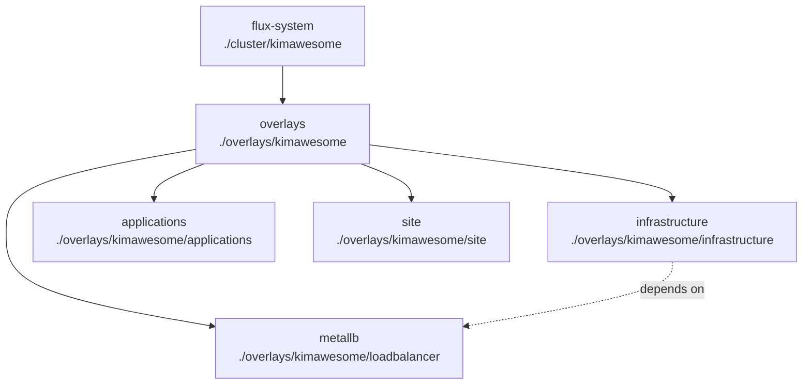

The Kimbernetes repository follows a structured approach to organize Kubernetes manifests, separating bootstrap configuration from application deployments using a layered Kustomize overlay pattern.

## Repository Overview

```
kimbernetes-k8s-flux/
├── cluster/
│   └── kimawesome/
│       ├── flux-system/
│       │   ├── gotk-components.yaml
│       │   ├── gotk-sync.yaml
│       │   └── kustomization.yaml
│       ├── kustomization.yaml
│       └── kustomization.flux.yaml
├── overlays/
│   ├── base/
│   │   ├── bind9/
│   │   ├── cert-manager/
│   │   ├── grafana/
│   │   ├── kgateway/
│   │   ├── metallb/
│   │   ├── prometheus/
│   │   ├── sealed-secrets/
│   │   └── ...
│   └── kimawesome/
│       ├── loadbalancer/
│       ├── infrastructure/
│       ├── applications/
│       ├── site/
│       ├── kustomization.yaml
│       └── README.md
├── cilium-values.yaml
├── .gitignore
└── README.md
```

## Directory Structure Explained

### cluster/

The `cluster/` directory contains the Flux bootstrap configuration and cluster-level resources. This is the entry point that Flux monitors.

<Tabs>
  <Tab title="flux-system/">
    **Purpose**: Flux system components and sync configuration
    
    - `gotk-components.yaml` - All Flux CRDs and controllers (v2.7.5)
    - `gotk-sync.yaml` - GitRepository and Kustomization resources that define what Flux watches
    - `kustomization.yaml` - Kustomize configuration to tie everything together
    
    <Note>
      These files are generated by `flux bootstrap` and should not be manually edited unless you know what you're doing.
    </Note>
  </Tab>
  
  <Tab title="kimawesome/">
    **Purpose**: Cluster-specific configuration for the kimawesome environment
    
    - `kustomization.yaml` - References the flux-system directory
    - `kustomization.flux.yaml` - Defines the Flux Kustomization resource that points to `overlays/kimawesome`
    
    This is where Flux starts its reconciliation process, defined in `cluster/kimawesome/flux-system/gotk-sync.yaml`:
    
    ```yaml
    apiVersion: kustomize.toolkit.fluxcd.io/v1
    kind: Kustomization
    metadata:
      name: flux-system
      namespace: flux-system
    spec:
      interval: 10m0s
      path: ./cluster/kimawesome
      prune: true
      sourceRef:
        kind: GitRepository
        name: flux-system
    ```
  </Tab>
</Tabs>

### overlays/

The `overlays/` directory is organized into two main layers: **base** and **environment-specific** (kimawesome).

#### overlays/base/

Contains reusable, environment-agnostic configurations. These are the building blocks that can be used across multiple environments.

<Accordion title="Infrastructure Components">
  **cert-manager/** - TLS certificate management
  
  **metallb/** - Bare-metal load balancer
  
  **sealed-secrets/** - Encrypted secrets management
  
  **metrics-server/** - Cluster metrics collection
  
  **kgateway/** - Kubernetes Gateway API implementation
</Accordion>

<Accordion title="Observability Stack">
  **grafana/** - Monitoring and visualization stack
  - `grafana-operator/` - Grafana Operator for managing Grafana instances
  - `grafana-alloy/` - Grafana Alloy for telemetry collection
  - `grafana-loki/` - Log aggregation system
  
  **prometheus/** - Metrics collection and alerting
</Accordion>

<Accordion title="Applications">
  **bind9/** - DNS server deployment
  
  **n8n/** - Workflow automation
  
  **yopass/** - Secure secret sharing
  
  **knowledge-hub/** - Internal knowledge base
  
  **tools/** - Utility applications
  - `http-echo/` - HTTP echo service for testing
  - `mysql/` - Database deployments
  - `no/` - Additional tooling
</Accordion>

Each base component follows a similar structure:

```
overlays/base/<component>/
├── kustomization.yaml       # Resource references
├── namespace.yaml          # (if needed) Namespace definition
├── helm-repository.yaml    # (if Helm) Chart repository
├── helm-release.yaml       # (if Helm) Chart release config
├── deployment.yaml         # (if manifest) Deployment
└── service.yaml           # (if manifest) Service
```

<Tip>
  Base configurations should be generic and parameterizable. They should not contain environment-specific values like domain names, IP addresses, or credentials.
</Tip>

#### overlays/kimawesome/

Contains environment-specific configurations and patches that extend the base configurations. This layer is organized by function:

<CardGroup cols={2}>
  <Card title="loadbalancer/" icon="scale-balanced">
    MetalLB configuration with IP address pools specific to the kimawesome environment
    
    ```yaml
    # kustomization.flux.yaml
    apiVersion: kustomize.toolkit.fluxcd.io/v1beta2
    kind: Kustomization
    metadata:
      name: metallb
      namespace: kube-system
    spec:
      interval: 10m
      path: "./overlays/kimawesome/loadbalancer"
      prune: true
      sourceRef:
        kind: GitRepository
        name: flux-system
        namespace: flux-system
    ```
  </Card>
  
  <Card title="infrastructure/" icon="server">
    Core infrastructure services with environment-specific settings
    
    Subdirectories include:
    - `apigateway/` - Gateway configuration
    - `cert-manager/` - Certificate issuers
    - `gatewayapi/` - Gateway API resources
    - `observability/` - Monitoring stack
    - `sealed-secrets/` - Secret encryption keys
    - `vpn/` - VPN configuration
  </Card>
  
  <Card title="applications/" icon="window">
    Application workloads deployed to the cluster
    
    Organized into:
    - `dns-server/` - DNS server with config
    - `tooling/` - n8n, yopass, and other tools
    - `version-management/` - Version control applications
    - `steering-k8s/` - Cluster management tools
  </Card>
  
  <Card title="site/" icon="globe">
    Website and documentation deployments
    
    Contains:
    - `articles/` - Article content
    - `knowledge-hub/` - Knowledge base application
  </Card>
</CardGroup>

The kimawesome overlay structure uses dependency management:

```yaml
# infrastructure depends on loadbalancer
apiVersion: kustomize.toolkit.fluxcd.io/v1beta2
kind: Kustomization
metadata:
  name: infrastructure
  namespace: flux-system
spec:
  interval: 10m
  path: "./overlays/kimawesome/infrastructure"
  prune: true
  sourceRef:
    kind: GitRepository
    name: flux-system
  dependsOn:
    - name: metallb
      namespace: kube-system
```

## How Overlays Reference Base

Environment-specific overlays inherit from base configurations using Kustomize's `resources` field:

```yaml
# overlays/kimawesome/infrastructure/cert-manager/kustomization.yaml
namespace: cert-manager
resources:
  - ../../../base/cert-manager
```

This pattern:
1. References the base configuration at `overlays/base/cert-manager/`
2. Sets the namespace for all resources
3. Can add patches, ConfigMaps, or additional resources

<Steps>
  <Step title="Base defines the blueprint">
    The base configuration in `overlays/base/cert-manager/` contains generic Helm repository and release definitions
  </Step>
  
  <Step title="Environment adds specifics">
    The kimawesome overlay at `overlays/kimawesome/infrastructure/cert-manager/` sets the namespace and can add environment-specific patches
  </Step>
  
  <Step title="Flux reconciles the result">
    The kustomize-controller processes both layers and applies the final manifests to the cluster
  </Step>
</Steps>

## Flux Kustomization Resources

The repository uses Flux's `Kustomization` custom resources to define what Flux should reconcile:



Each Flux Kustomization resource is defined in a `*.flux.yaml` file:

```yaml
# overlays/kimawesome/kustomization.yaml
resources:
  - loadbalancer/kustomization.flux.yaml
  - infrastructure/kustomization.flux.yaml
  - applications/kustomization.flux.yaml
  - site/kustomization.flux.yaml
```

## Root Level Files

<Accordion title="cilium-values.yaml">
  Configuration values for the Cilium CNI plugin. Used during cluster bootstrap to configure:
  - Kube-proxy replacement
  - NodePort enablement
  - Gateway API integration
</Accordion>

<Accordion title=".gitignore">
  Excludes temporary files, secrets, and local development artifacts from version control.
</Accordion>

<Accordion title="README.md">
  Contains cluster creation instructions, bootstrap procedures, and operational notes specific to the kimawesome cluster.
</Accordion>

## Directory Naming Conventions

<Note>
  **Consistency is key** - Following naming conventions makes the repository easier to navigate and maintain.
</Note>

| Pattern | Purpose | Example |
|---------|---------|---------|
| `kustomization.yaml` | Standard Kustomize configuration | Resource aggregation |
| `kustomization.flux.yaml` | Flux Kustomization CRD | GitOps sync definition |
| `helm-repository.yaml` | Helm repository source | Chart source definition |
| `helm-release.yaml` | Helm release configuration | Chart deployment settings |
| `namespace.yaml` | Namespace definition | Namespace creation |
| `*-config.yaml` | ConfigMap resources | Application configuration |
| `*-secret.yaml` | Sealed Secret resources | Encrypted credentials |

## Navigation Tips

<Tabs>
  <Tab title="Finding a Component">
    1. Check `overlays/base/` for the base configuration
    2. Look in `overlays/kimawesome/` subdirectories for environment-specific overlays
    3. Search for `kustomization.flux.yaml` files to understand deployment order
  </Tab>
  
  <Tab title="Understanding Dependencies">
    Look for `dependsOn` fields in Flux Kustomization resources to understand deployment order and dependencies between components.
  </Tab>
  
  <Tab title="Tracking Changes">
    Use `git log` on specific directories to understand the evolution of configurations:
    ```bash
    git log --follow overlays/base/cert-manager/
    ```
  </Tab>
</Tabs>

## Next Steps

<CardGroup cols={2}>
  <Card title="Flux Components" icon="cubes" href="/architecture/flux-components">
    Learn about the Flux controllers that reconcile these configurations
  </Card>
  <Card title="Kustomize Overlays" icon="layer-group" href="/architecture/kustomize-overlays">
    Deep dive into how overlays work and how to create new ones
  </Card>
  <Card title="Adding Applications" icon="plus" href="/operations/managing-resources">
    Step-by-step guide to adding new applications to the repository
  </Card>
  <Card title="Managing Secrets" icon="lock" href="/infrastructure/sealed-secrets">
    Learn how to securely manage secrets with Sealed Secrets
  </Card>
</CardGroup>
