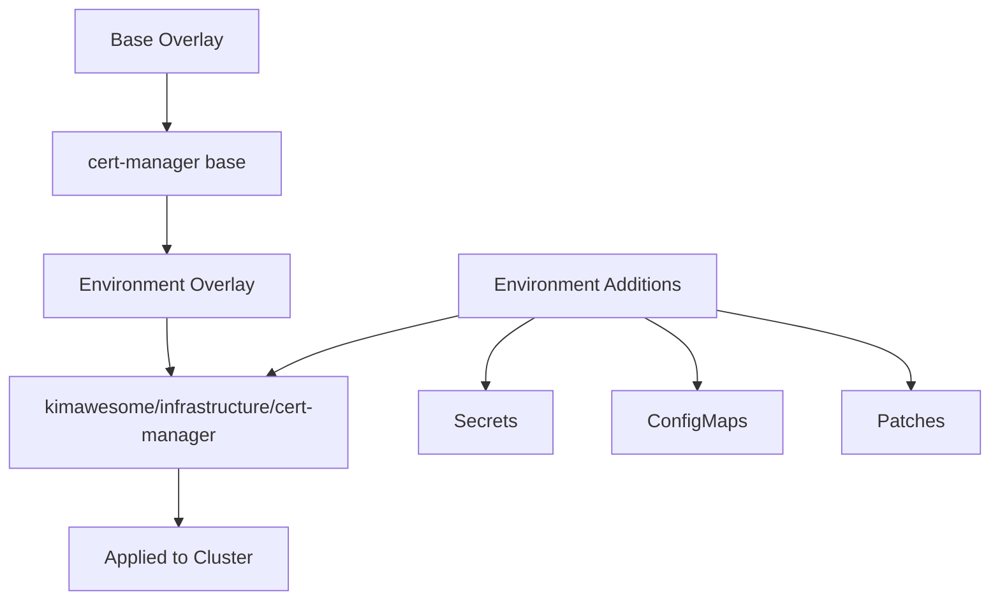

Environment overlays customize base component configurations for specific clusters or environments. The `kimawesome` environment overlay demonstrates how to add environment-specific settings, secrets, and resources.

## Directory Structure

```
overlays/kimawesome/
├── kustomization.yaml              # Root overlay kustomization
├── infrastructure/                 # Infrastructure components
│   ├── kustomization.yaml
│   ├── kustomization.flux.yaml    # Flux Kustomization
│   ├── storage-class.yaml         # Environment-specific storage
│   ├── apigateway/                # Gateway configurations
│   ├── base-certificate/          # TLS issuers
│   ├── cert-manager/              # cert-manager customization
│   ├── gatewayapi/                # Gateway API setup
│   ├── http-echo/                 # Test application
│   ├── metrics-server/            # Metrics configuration
│   ├── observability/             # Monitoring stack
│   ├── sealed-secrets/            # Sealed secrets namespace
│   └── vpn/                       # VPN configuration
├── loadbalancer/                  # MetalLB configuration
│   ├── kustomization.yaml
│   ├── kustomization.flux.yaml
│   ├── ippool.yaml               # IP address pool
│   └── l2advertisement.yaml      # Layer 2 advertisement
├── applications/                  # Application workloads
│   ├── kustomization.yaml
│   ├── kustomization.flux.yaml
│   ├── dns-server/               # DNS server config
│   ├── steering-k8s/             # Steering application
│   ├── tooling/                  # Development tools (n8n, yopass)
│   └── version-management/       # Version tracking
└── site/                          # Website components
    ├── kustomization.yaml
    ├── kustomization.flux.yaml
    ├── namespace.yaml
    ├── articles/
    └── knowledge-hub/
```

## How Overlays Work

Environment overlays use Kustomize to:

1. **Reference base overlays** - Import base component definitions
2. **Add environment-specific resources** - Secrets, ConfigMaps, gateways
3. **Patch configurations** - Modify base settings for the environment
4. **Organize by namespace** - Group related components together

## Infrastructure Overlay

### Root Infrastructure Kustomization

<Tabs>
  <Tab title="Flux Kustomization">
    ```yaml overlays/kimawesome/infrastructure/kustomization.flux.yaml
    apiVersion: kustomize.toolkit.fluxcd.io/v1beta2
    kind: Kustomization
    metadata:
      name: infrastructure
      namespace: flux-system
    spec:
      interval: 10m
      path: "./overlays/kimawesome/infrastructure"
      prune: true
      sourceRef:
        kind: GitRepository
        name: flux-system
      dependsOn:
        - name: metallb
          namespace: kube-system
    ```
    
    This tells Flux to apply the infrastructure overlay and wait for MetalLB to be ready first.
  </Tab>
  <Tab title="Kustomization">
    ```yaml overlays/kimawesome/infrastructure/kustomization.yaml
    namespace: kube-system
    resources:
      - storage-class.yaml
      - cert-manager
      - gatewayapi/kustomization.flux.yaml
      - base-certificate/kustomization.flux.yaml
      - apigateway
      - observability
      - sealed-secrets
      - metrics-server
      - vpn/kustomization.flux.yaml
      - http-echo
    ```
    
    Groups all infrastructure components together.
  </Tab>
</Tabs>

### Storage Class

Environment-specific storage configuration:

```yaml overlays/kimawesome/infrastructure/storage-class.yaml
apiVersion: storage.k8s.io/v1
kind: StorageClass
metadata:
  name: local-storage
provisioner: kubernetes.io/no-provisioner
volumeBindingMode: WaitForFirstConsumer
allowVolumeExpansion: true
```

### cert-manager Overlay

References the base and inherits all settings:

```yaml overlays/kimawesome/infrastructure/cert-manager/kustomization.yaml
namespace: cert-manager
resources:
  - ../../../base/cert-manager
```

No patches needed - uses base configuration as-is.

### Observability Stack

Combines multiple monitoring components:

```yaml overlays/kimawesome/infrastructure/observability/kustomization.yaml
namespace: observability
resources:
  - namespace.yaml
  - grafana-alloy
  - prometheus
  - ../../../base/grafana/helm-repository.yaml
  - grafana-operator
  - monitors-infrastructure/kustomization.flux.yaml
  - grafana-loki
```

#### Prometheus Customization

Environment overlay adds persistent volumes:

```yaml overlays/kimawesome/infrastructure/observability/prometheus/kustomization.yaml
namespace: observability
resources:
  - ../../../../base/prometheus
  - prometheus-pv.yaml
```

```yaml overlays/kimawesome/infrastructure/observability/prometheus/prometheus-pv.yaml
apiVersion: v1
kind: PersistentVolume
metadata:
  name: prometheus-data-0
spec:
  capacity:
    storage: 50Gi
  accessModes:
    - ReadWriteOnce
  persistentVolumeReclaimPolicy: Retain
  storageClassName: local-storage
  local:
    path: /mnt/data/prometheus-0
  nodeAffinity:
    required:
      nodeSelectorTerms:
        - matchExpressions:
            - key: kubernetes.io/hostname
              operator: In
              values:
                - node-1
```

#### Grafana Operator with Secrets

```yaml overlays/kimawesome/infrastructure/observability/grafana-operator/kustomization.yaml
namespace: observability
resources:
  - ../../../../base/grafana/grafana-operator
  - grafana.yaml
  - grafana-persistence.yaml
  - credentials.sealed.yaml
  - httproute.yaml
```

Adds:
- Grafana instance custom resource
- Persistent volume claims
- Sealed secrets for admin credentials
- HTTPRoute for external access

### API Gateway Configuration

Environment-specific gateway resources:

```yaml overlays/kimawesome/infrastructure/apigateway/kustomization.yaml
namespace: default
resources:
  - http-gateway.yaml
  - https-gateway.yaml
  - internal-gateway.yaml
```

Defines Gateway resources for different protocols and access levels.

### Certificate Issuers

```yaml overlays/kimawesome/infrastructure/base-certificate/kustomization.yaml
namespace: cert-manager
resources:
  - cluster-issuer.yaml
  - stg-cluster-issuer.yaml
```

Configures Let's Encrypt production and staging issuers.

## LoadBalancer Overlay

Configures MetalLB with environment-specific IP pools:

<Tabs>
  <Tab title="kustomization.yaml">
    ```yaml overlays/kimawesome/loadbalancer/kustomization.yaml
    namespace: metallb-system
    resources:
      - ../../base/metallb
      - ippool.yaml
      - l2advertisement.yaml
    ```
  </Tab>
  <Tab title="ippool.yaml">
    ```yaml overlays/kimawesome/loadbalancer/ippool.yaml
    apiVersion: metallb.io/v1beta1
    kind: IPAddressPool
    metadata:
      name: default-pool
      namespace: metallb-system
    spec:
      addresses:
        - 192.168.1.100-192.168.1.110
    ```
  </Tab>
  <Tab title="l2advertisement.yaml">
    ```yaml overlays/kimawesome/loadbalancer/l2advertisement.yaml
    apiVersion: metallb.io/v1beta1
    kind: L2Advertisement
    metadata:
      name: default-l2
      namespace: metallb-system
    spec:
      ipAddressPools:
        - default-pool
    ```
  </Tab>
</Tabs>

## Applications Overlay

Manages application workloads:

```yaml overlays/kimawesome/applications/kustomization.yaml
resources:
  - dns-server
  - steering-k8s
  - tooling
  - version-management
```

### Tooling Applications

Development and operations tools:

```yaml overlays/kimawesome/applications/tooling/kustomization.yaml
namespace: tooling
resources:
  - namespace.yaml
  - yopass
  - n8n
  - no
```

#### n8n with Patches

Customizes the base n8n HelmRelease:

```yaml overlays/kimawesome/applications/tooling/n8n/kustomization.yaml
namespace: tooling
resources:
  - ../../../../base/n8n
  - httproute.yaml
patchesStrategicMerge:
  - helm-release.patch.yaml
```

```yaml overlays/kimawesome/applications/tooling/n8n/helm-release.patch.yaml
apiVersion: helm.toolkit.fluxcd.io/v2
kind: HelmRelease
metadata:
  name: n8n
  namespace: tooling
spec:
  values:
    persistence:
      enabled: true
      size: 10Gi
    ingress:
      enabled: false
```

### DNS Server Customization

```yaml overlays/kimawesome/applications/dns-server/kustomization.yaml
namespace: dns-server
resources:
  - namespace.yaml
  - ../../../base/bind9
patchesStrategicMerge:
  - service.patch.yaml
  - tailscale-service.yaml
```

Adds Tailscale VPN service and modifies base service.

## Inheritance Pattern



## Common Customization Patterns

### Pattern 1: Use Base As-Is

```yaml
namespace: cert-manager
resources:
  - ../../../base/cert-manager
```

No customization needed - base is sufficient.

### Pattern 2: Add Resources

```yaml
namespace: observability
resources:
  - ../../../base/prometheus
  - prometheus-pv.yaml
  - service-monitors.yaml
```

Base provides Prometheus, overlay adds storage and monitors.

### Pattern 3: Patch Configuration

```yaml
namespace: tooling
resources:
  - ../../../base/n8n
patchesStrategicMerge:
  - helm-release.patch.yaml
```

Modify base HelmRelease values for environment.

### Pattern 4: Combine Multiple Bases

```yaml
namespace: observability
resources:
  - ../../../base/prometheus
  - ../../../base/grafana/grafana-operator
  - ../../../base/grafana/grafana-loki
  - grafana-instance.yaml
  - datasources.yaml
```

Combine related components from multiple bases.

## Managing Secrets

Use Sealed Secrets for environment-specific credentials:

<CodeGroup>
```bash Create Secret
kubectl create secret generic grafana-admin \
  --from-literal=username=admin \
  --from-literal=password=secret123 \
  --namespace=observability \
  --dry-run=client -o yaml > secret.yaml
```

```bash Seal Secret
kubeseal -f secret.yaml -w credentials.sealed.yaml
```

```yaml Use in Kustomization
resources:
  - credentials.sealed.yaml
```
</CodeGroup>

## Testing Overlays

### Preview Changes

See what will be applied:

```bash
kubectl kustomize overlays/kimawesome/infrastructure/
kubectl kustomize overlays/kimawesome/applications/
```

### Diff Against Cluster

```bash
kubectl diff -k overlays/kimawesome/infrastructure/
```

### Apply Manually

```bash
kubectl apply -k overlays/kimawesome/infrastructure/ --dry-run=server
```

## Environment Variables

Use Kustomize variable substitution:

```yaml
apiVersion: kustomize.toolkit.fluxcd.io/v1
kind: Kustomization
metadata:
  name: infrastructure
spec:
  postBuild:
    substitute:
      CLUSTER_NAME: "kimawesome"
      DOMAIN: "kim.tec.br"
```

Reference in manifests:

```yaml
metadata:
  labels:
    cluster: ${CLUSTER_NAME}
spec:
  host: grafana.${DOMAIN}
```

## Best Practices

<Accordion title="Keep overlays thin">
  Only include what differs from base. Don't duplicate base configuration.
</Accordion>

<Accordion title="Use descriptive names">
  Name overlay directories after their purpose: `production`, `staging`, `kimawesome`
</Accordion>

<Accordion title="Document customizations">
  Add comments explaining why environment-specific settings exist
</Accordion>

<Accordion title="Group by namespace">
  Organize overlays by namespace for clear resource boundaries
</Accordion>

<Accordion title="Version control secrets">
  Use Sealed Secrets to safely commit encrypted secrets to Git
</Accordion>

<Accordion title="Test before merging">
  Preview changes with `kubectl kustomize` and validate with `kubectl diff`
</Accordion>

## Multiple Environments

To add another environment:

```
overlays/
├── base/              # Shared base configurations
├── kimawesome/        # Production environment
└── staging/           # New staging environment
    ├── infrastructure/
    ├── applications/
    └── kustomization.yaml
```

Update Flux Kustomization:

```yaml
apiVersion: kustomize.toolkit.fluxcd.io/v1
kind: Kustomization
metadata:
  name: staging-infrastructure
  namespace: flux-system
spec:
  interval: 10m
  path: "./overlays/staging/infrastructure"
  sourceRef:
    kind: GitRepository
    name: flux-system
```

## Related Resources

- [Base Overlays](/reference/base-overlays)
- [Flux Kustomizations](/reference/flux-kustomizations)
- [HelmReleases Reference](/reference/helm-releases)
- [Useful Commands](/reference/useful-commands)
